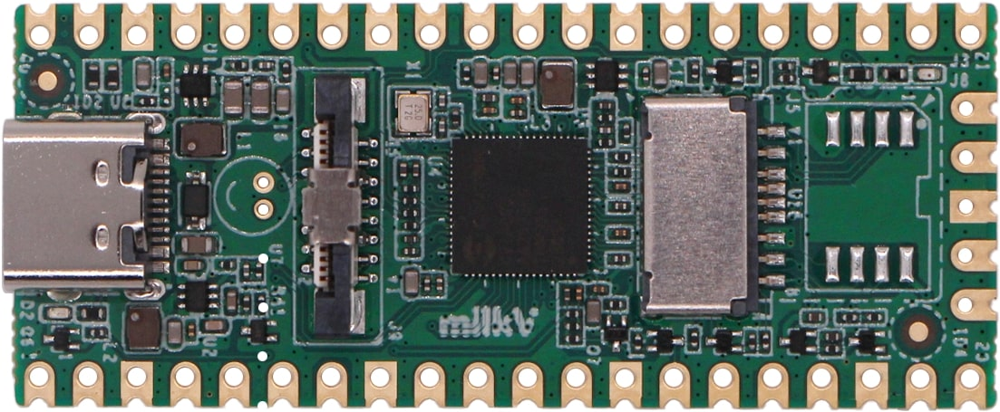

.. role:: underline
   :class: underline

MilkV DUO
=========

+----------------+-----------------+
| System on Chip | Sophgo cv1800b  |
+----------------+-----------------+
| Number GPIO    | 22              |
+----------------+-----------------+
| Status         | Fully supported |
+----------------+-----------------+

Supported Features
------------------

+----------------+-----------------+
| Read / Write   | |yes|           |
+----------------+-----------------+
| Interrupt      | |yes|           |
+----------------+-----------------+

GPIO Mapping
------------

+----+----+----+----+----+----+----+----+----+----+----+----+----+----+----+----+----+----+----+----+-----+-----+
|3.3v|3.3v| 0v |3.3v|3.3v|3.3v|3.3v| 0v | 27 | 26 |3.3v| 22 | 0v | 21 | 20 | 19 | 18 | 0v | 17 | 16 | N/A | N/A |
+----+----+----+----+----+----+----+----+----+----+----+----+----+----+----+----+----+----+----+----+-----+-----+
| 0  | 1  | 0v | 2  | 3  | 4  | 5  | 0v | 6  | 7  | 8  | 9  | 0v | 10 | 11 | 12 | 13 | 0v |3.3v| 15 | N/A | 25  |
+----+----+----+----+----+----+----+----+----+----+----+----+----+----+----+----+----+----+----+----+-----+-----+

Note: No. 25 is the user LED.
